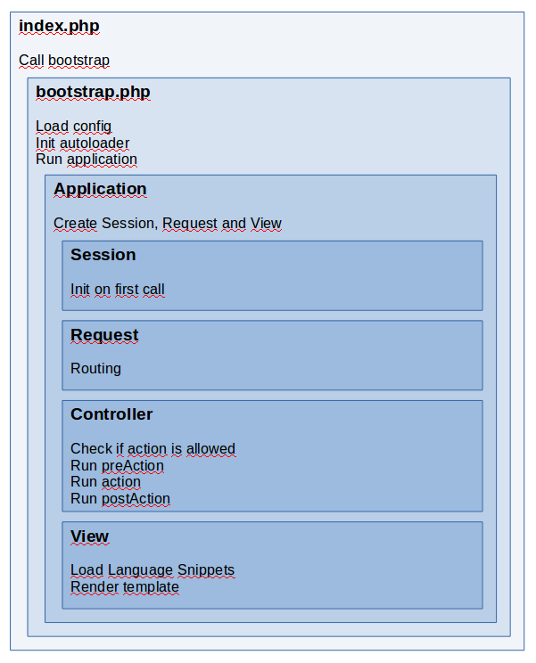

A normal webrequest
===================

For security reasons, the whole web application is set outside the webroot directory under ~/app.
The entry point for every page request is therefore the index.php which calls the web application bootstrap file.

The bootstrap.php in the ~/app directory prepares and runs the application. 
It loads the config array, defines Constants, sets up the autoloader. 
Finally it Loads the Application and calls the run method.

The application initialises the Session, Request and View objects.
It calls the routing in the Request object to determine the names of module, controller and action.
Hereafter it tries to construct the application controller and calls the desired action.

The controller executes the business logic: Get an check input, process data, establish the content for the output

Finally the Application calls the render method of the view object.

You can get an overview of the whole process in the following diagram:

